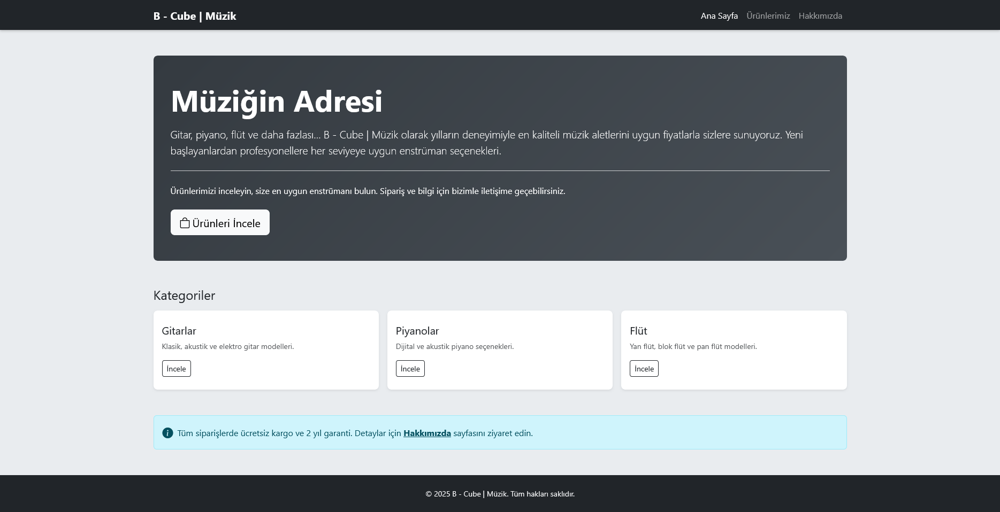
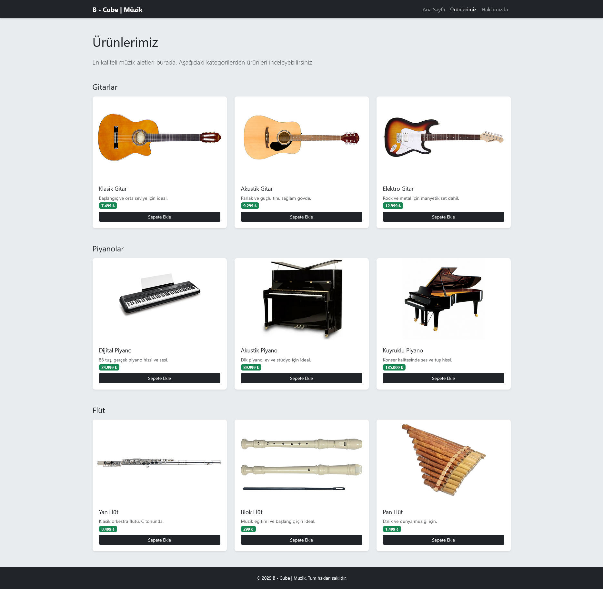
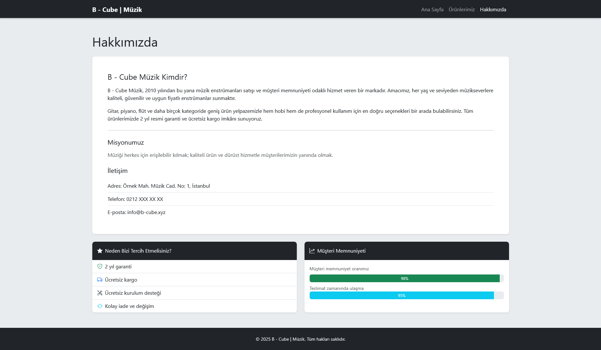

# Müzik Dükkanım - Bootstrap Ödev 1

Bu proje, Patika.dev Bootstrap eğitimi kapsamında geliştirilmiş bir müzik aletleri e-ticaret sitesidir. Site, HTML, CSS ve Bootstrap 5 framework'ü kullanılarak oluşturulmuş, modern ve responsive bir arayüze sahiptir.

## 📋 Proje Hakkında

Müzik Dükkanım, müzik severlere kaliteli ve uygun fiyatlı müzik aletleri sunmayı amaçlayan bir e-ticaret sitesidir. Site, 2010 yılında kurulmuş olup, müşterilerine en iyi hizmeti sunmayı hedeflemektedir.

## 🎯 Özellikler

- **3 Ana Sayfa**: Ana Sayfa, Ürünlerimiz ve Hakkımızda sayfaları
- **Bootstrap 5 Framework**: Modern ve responsive tasarım
- **Responsive Grid System**: Mobil, tablet ve masaüstü uyumlu
- **Bootstrap Components**: Navbar, Cards, Buttons, Badges kullanımı
- **Ürün Kataloğu**: 3 farklı müzik aleti kategorisi (Gitar, Piyano, Flüt)
- **Temiz Kod Yapısı**: Semantik HTML ve Bootstrap utility classes

## 📁 Proje Yapısı

```
patika.dev_bootstrap_odev_1_muzik_dukkanim/
│
├── index.html          # Ana sayfa
├── urunlerimiz.html    # Ürünler sayfası
├── hakkimizda.html     # Hakkımızda sayfası
├── images/             # Ürün görselleri ve ekran görüntüleri
│   ├── index.png
│   ├── urunlerimiz.png
│   ├── hakkimizda.png
│   ├── gitar/
│   │   ├── akustik-gitar.jpg
│   │   ├── elektro-gitar.jpg
│   │   └── klasik-gitar.jpg
│   ├── piyano/
│   │   ├── akustik-piyano.jpg
│   │   ├── dijital-piyano.jpg
│   │   └── kuyruklu-piyano.jpg
│   └── flut/
│       ├── blok-flut.jpg
│       ├── pan-flut.jpg
│       └── yan-flut.jpg
└── README.md          # Proje dokümantasyonu
```

## 🖼️ Ekran Görüntüleri

### 1. Ana Sayfa (Home Page)



Ana sayfa, ziyaretçileri karşılayan hoş geldiniz mesajı ve sitede bulunan müzik aletlerinin listesini içerir. Sayfa, temiz ve sade bir tasarıma sahiptir.

**Özellikler:**

- Bootstrap Navbar ile navigasyon menüsü
- Hoş geldiniz mesajı
- Müzik aletleri kategorileri (Gitar, Piyano, Flüt)
- Ürünler sayfasına yönlendiren link
- Responsive tasarım

### 2. Ürünlerimiz Sayfası (Products Page)



Ürünler sayfası, sitede satılan tüm müzik aletlerini kart formatında gösterir. Her ürün kartında görsel, açıklama, eski fiyat, indirimli fiyat ve "Satın Al" butonu bulunur.

**Özellikler:**

- Bootstrap Card component'i ile ürün kartları
- 3 farklı müzik aleti kategorisi (Gitar, Piyano, Flüt)
- Her kategori için 3 ürün
- Bootstrap Grid System ile responsive layout
- Her ürün kartında görsel ve açıklama
- Bootstrap Button component'i ile "Satın Al" butonları

**Ürünler:**

**Gitar Kategorisi:**
- Akustik Gitar
- Elektro Gitar
- Klasik Gitar

**Piyano Kategorisi:**
- Akustik Piyano
- Dijital Piyano
- Kuyruklu Piyano

**Flüt Kategorisi:**
- Blok Flüt
- Pan Flüt
- Yan Flüt

### 3. Hakkımızda Sayfası (About Us Page)



Hakkımızda sayfası, şirketin kuruluş hikayesi, vizyonu ve misyonu hakkında bilgiler içerir.

**İçerik:**

- Şirket hakkında bilgi (2010'da kuruldu)
- Vizyonumuz: Müziği herkese erişilebilir kılmak
- Misyonumuz: Kaliteli ürünler ve profesyonel hizmet sunmak

## 🎨 Tasarım Özellikleri

### Bootstrap Components Kullanımı

- **Navbar**: Responsive navigasyon menüsü
- **Cards**: Ürün kartları için card component'i
- **Grid System**: 12 kolonlu responsive grid yapısı
- **Buttons**: Primary ve secondary button stilleri
- **Badges**: Ürün fiyatları için badge kullanımı
- **Container**: Responsive container yapısı

### Bootstrap Utility Classes

- Spacing utilities (margin, padding)
- Color utilities (text, background)
- Display utilities (flex, grid)
- Responsive breakpoints (sm, md, lg, xl, xxl)

### Renk Paleti

- Bootstrap'in varsayılan renk sistemi kullanılmıştır
- Primary: Bootstrap primary color
- Secondary: Bootstrap secondary color
- Custom colors: Gerekli yerlerde özel renkler

## 🚀 Kullanım

1. Projeyi bilgisayarınıza indirin veya klonlayın
2. `index.html` dosyasını bir web tarayıcısında açın
3. Navigasyon menüsünden farklı sayfalara geçiş yapabilirsiniz

## 📝 Teknik Detaylar

### HTML Yapısı

- Semantik HTML5 etiketleri kullanılmıştır
- `<header>`, `<nav>`, `<main>`, `<section>`, `<footer>` gibi yapısal etiketler
- Türkçe dil desteği (`lang="tr"`)
- Responsive meta etiketleri

### Bootstrap Özellikleri

- Bootstrap 5 CDN entegrasyonu
- Grid system ile responsive layout
- Bootstrap component'leri (Navbar, Cards, Buttons)
- Utility classes ile hızlı stil verme
- Responsive breakpoints kullanımı
- Custom CSS ile Bootstrap'i özelleştirme

## 👨‍💻 Geliştirici

Bahadır B. Bekdemir

Bu proje eğitim amaçlı geliştirilmiştir.

## 📄 Lisans

© 2026 Tüm Hakları Saklıdır.

---

**Not:** Bu proje Patika.dev Bootstrap eğitimi kapsamında hazırlanmıştır.

## 📚 Bootstrap Öğrenilenler

- Bootstrap 5 kurulumu ve CDN kullanımı
- Grid System ve responsive breakpoints
- Navbar component'i ve responsive menü
- Card component'i ile ürün kartları
- Button ve Badge component'leri
- Utility classes kullanımı
- Custom CSS ile Bootstrap'i özelleştirme
