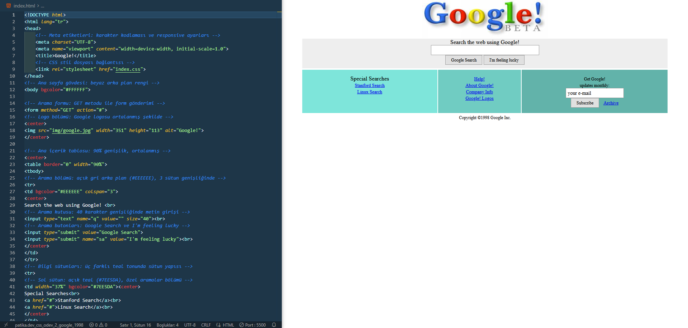

# Google 1998 Ana Sayfası - CSS Ödev 2

Bu proje, Patika.dev CSS eğitimi kapsamında geliştirilmiş bir Google 1998 ana sayfası klonudur. Site, HTML ve CSS kullanılarak oluşturulmuş, orijinal 1998 Google tasarımının sadık bir benzer kopyasını sunmaktadır.

> ⚠️ **Bu proje tamamen eğitim amaçlıdır.**

## 📋 Proje Hakkında

Google 1998 Ana Sayfası Klonu, Google'ın 1998 yılındaki ilk ana sayfasının görsel ve yapısal bir kopyasını oluşturmaktadır. Bu proje, Wayback Machine'deki orijinal sayfadan esinlenilerek geliştirilmiş olup, nostaljik web tasarımının önemli bir örneğini sunmaktadır. Proje, CSS ve HTML öğrenmek isteyen öğrenciler için eğitim amaçlı hazırlanmıştır.

### 📜 Google Tarihçesi

Google, 1996 yılında Stanford Üniversitesi'nde doktora öğrencileri Larry Page ve Sergey Brin tarafından kurulmuştur. Şirket, 1998 yılında resmi olarak yayınlanmış ve internet arama motoru olarak hizmet vermeye başlamıştır. Bu proje, Google'ın ilk ana sayfasının görsel bir kopyasını sunmaktadır. Orijinal sayfanın ilk görüntüsü [Wayback Machine arşivinde](https://web.archive.org/web/19981202230410if_/http://www.google.com/) görüntülenebilir.

## 🎯 Özellikler

- **Orijinal Tasarım**: 1998 Google ana sayfasının görsel olarak birebir kopyası
- **Renkli Sütun Yapısı**: Üç farklı teal tonunda bilgi sütunları
- **Arama Fonksiyonu**: Google Search ve "I'm feeling lucky" butonları
- **Özel Aramalar**: Stanford Search ve Linux Search linkleri
- **E-posta Aboneliği**: Aylık güncellemeler için abonelik formu
- **Wayback Machine CSS**: Arşiv görünümü için gerekli CSS stilleri

## 📁 Proje Yapısı

```
patika.dev_css_odev_2_google_1998/
│
├── img/
│   ├── google.jpg          # Google logosu (351x113px)
│   └── index.png          # Sayfa görseli
│
├── index.html              # Ana HTML dosyası
├── index.css               # CSS stilleri
└── README.md               # Proje dokümantasyonu
```

## 🖼️ Sayfa Yapısı



### Ana Bölümler

1. **Logo Bölümü**
   - Google logosu (351x113px)
   - Sayfa üstünde ortalanmış konumda

2. **Arama Bölümü** (`#EEEEEE` - Açık gri arka plan)
   - "Search the web using Google!" başlığı
   - Arama kutusu (40 karakter genişliğinde)
   - "Google Search" butonu
   - "I'm feeling lucky" butonu

3. **Bilgi Sütunları** (Üç sütunlu yapı)
   - **Sol Sütun** (`#7EE5DA` - Açık teal)
     - Special Searches başlığı
     - Stanford Search linki
     - Linux Search linki
   
   - **Orta Sütun** (`#70CCC2` - Orta teal)
     - Help! linki
     - About Google! linki
     - Company Info linki
     - Google! Logos linki
   
   - **Sağ Sütun** (`#62B3AA` - Koyu teal)
     - "Get Google! updates monthly:" başlığı
     - E-posta giriş kutusu
     - Subscribe butonu
     - Archive linki

4. **Telif Hakkı**
   - Alt kısımda "Copyright ©1998 Google Inc." metni

## 🎨 Tasarım Özellikleri

### Renk Paleti

- **Üst Bölüm (Arama)**: `#EEEEEE` (Açık gri)
- **Sol Sütun**: `#7EE5DA` (Açık teal)
- **Orta Sütun**: `#70CCC2` (Orta teal)
- **Sağ Sütun**: `#62B3AA` (Koyu teal)
- **Arka Plan**: `#FFFFFF` (Beyaz)
- **Linkler**: `#0000ee` (Mavi)
- **Linkler (Hover)**: `#551a8b` (Mor)

### Tipografi

- **Font Ailesi**: Times New Roman, Times, serif
- **Font Ağırlığı**: Normal (400)
- **Link Font Boyutu**: 13px
- **Küçük Metin**: 12px (`font size="-1"`)

### Layout

- **Tablo Genişliği**: 90%
- **Tablo Hizalama**: Ortalanmış
- **Border Spacing**: 0 2px (satırlar arası 2px boşluk)
- **Sütunlar Arası Boşluk**: 2px (beyaz border)
- **Padding**: 
  - Arama bölümü: 10px (üst-alt) x 20px (sağ-sol)
  - Bilgi sütunları: 15px

## 🚀 Kullanım

1. Projeyi bilgisayarınıza indirin veya klonlayın
2. `index.html` dosyasını bir web tarayıcısında açın
3. 1998 Google ana sayfasının nostaljik görünümünü keşfedin!

## 📝 Teknik Detaylar

### HTML Yapısı

- Semantik HTML5 etiketleri kullanılmıştır
- Türkçe dil desteği (`lang="tr"`)
- Responsive meta etiketleri
- Tablo tabanlı layout (1998 dönemine uygun)
- Form yapısı ile arama ve abonelik işlevleri
- `<center>`, `<font>` gibi eski HTML etiketleri (orijinal tasarıma uygun)

### CSS Özellikleri

- CSS Reset ile başlangıç (`* { margin: 0; padding: 0; }`)
- Tablo tabanlı layout (`border-collapse: separate`)
- Border spacing ile satırlar arası boşluk
- Attribute selector kullanımı (`td[bgcolor="#EEEEEE"]`)
- Hover efektleri (linkler ve butonlar)
- Font ailesi tanımlamaları
- Wayback Machine toolbar CSS stilleri

### Özel CSS Özellikleri

- **Border Spacing**: Satırlar arası 2px boşluk
- **Sütun Ayırıcıları**: Beyaz border ile 2px boşluk
- **Logo Ortalama**: Margin auto ile merkez hizalama
- **Responsive Tablo**: 90% genişlik ile esnek yapı

## 📚 Öğrenilen CSS Konuları

Bu projede aşağıdaki CSS konuları uygulanmıştır:

1. **CSS Reset**: Varsayılan tarayıcı stillerini sıfırlama
2. **Table Layout**: Tablo tabanlı düzen sistemi
3. **Border Spacing**: Tablo hücreleri arası boşluk
4. **Attribute Selectors**: Özellik seçicileri (`td[bgcolor]`)
5. **Color Management**: Hex renk formatları
6. **Typography**: Font family, size, weight
7. **Hover Effects**: Link ve buton hover efektleri
8. **Form Styling**: Input ve button stilleri
9. **Legacy HTML Support**: Eski HTML etiketleri ile uyumluluk

## 🔧 Özelleştirme

CSS dosyasındaki değerleri değiştirerek renkleri, fontları ve düzeni özelleştirebilirsiniz:

- `index.css` dosyasını düzenleyin
- Renk kodlarını değiştirin (`#EEEEEE`, `#7EE5DA`, vb.)
- Font ailesini güncelleyin (`Times New Roman`)
- Padding ve margin değerlerini ayarlayın
- Border spacing değerini değiştirin

## 📚 Kaynaklar

Bu proje, Wayback Machine'deki orijinal 1998 Google ana sayfasından esinlenilerek oluşturulmuştur:

- **Orijinal Sayfa (İlk Görüntü)**: [Wayback Machine - Google 1998](https://web.archive.org/web/19981202230410if_/http://www.google.com/)
- **Arşiv Sayfası**: [Wayback Machine - Google 1998](https://web.archive.org/web/19981202230410/http://www.google.com/)

## 👨‍💻 Geliştirici

**Bahadır B. Bekdemir**

Bu proje eğitim amaçlı geliştirilmiştir.

## 📄 Lisans

© 2026 Tüm Hakları Saklıdır.

---

**⚠️ Önemli Uyarı**: Bu proje Patika.dev CSS eğitimi kapsamında hazırlanmıştır ve **tamamen eğitim amaçlıdır**. Google'ın ticari markaları ve telif hakları Google Inc.'e aittir. Bu proje sadece eğitim ve öğrenme amaçlıdır. Ticari kullanım için tasarlanmamıştır.
