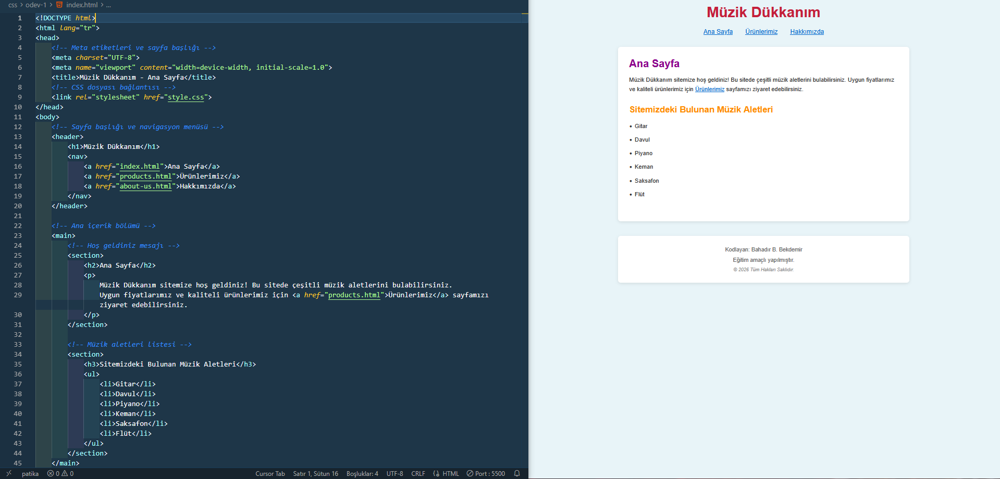
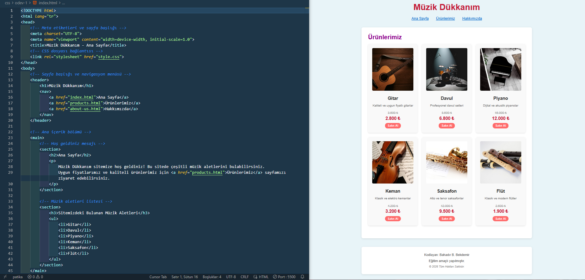
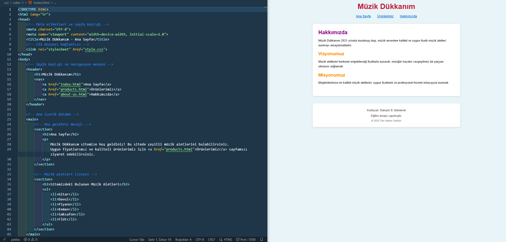

# Müzik Dükkanım - CSS Ödev 1

Bu proje, Patika.dev CSS eğitimi kapsamında geliştirilmiş bir müzik aletleri e-ticaret sitesidir. Site, HTML ve CSS kullanılarak oluşturulmuş, modern ve kullanıcı dostu bir arayüze sahiptir.

## 📋 Proje Hakkında

Müzik Dükkanım, müzik severlere kaliteli ve uygun fiyatlı müzik aletleri sunmayı amaçlayan bir e-ticaret sitesidir. Site, 2021 yılında kurulmuş olup, müşterilerine en iyi hizmeti sunmayı hedeflemektedir.

## 🎯 Özellikler

- **3 Ana Sayfa**: Ana Sayfa, Ürünlerimiz ve Hakkımızda sayfaları
- **Responsive Tasarım**: Modern ve kullanıcı dostu arayüz
- **Ürün Kataloğu**: 6 farklı müzik aleti kategorisi
- **Temiz Kod Yapısı**: Semantik HTML ve organize CSS

## 📁 Proje Yapısı

```
patika.dev_css_odev_1/
│
├── index.html          # Ana sayfa
├── products.html       # Ürünler sayfası
├── about-us.html      # Hakkımızda sayfası
├── style.css          # Stil dosyası
├── images/            # Ürün görselleri ve ekran görüntüleri
│   ├── anasayfa.png
│   ├── ürünlerimiz.png
│   ├── hakkımızda.png
│   ├── gitar.jpg
│   ├── davul.jpg
│   ├── piyano.jpg
│   ├── keman.jpg
│   ├── saksafon.jpg
│   └── flüt.jpg
└── README.md          # Proje dokümantasyonu
```

## 🖼️ Ekran Görüntüleri

### 1. Ana Sayfa (Home Page)



Ana sayfa, ziyaretçileri karşılayan hoş geldiniz mesajı ve sitede bulunan müzik aletlerinin listesini içerir. Sayfa, temiz ve sade bir tasarıma sahiptir.

**Özellikler:**
- Hoş geldiniz mesajı
- Müzik aletleri listesi (Gitar, Davul, Piyano, Keman, Saksafon, Flüt)
- Ürünler sayfasına yönlendiren link

### 2. Ürünlerimiz Sayfası (Products Page)



Ürünler sayfası, sitede satılan tüm müzik aletlerini kart formatında gösterir. Her ürün kartında görsel, açıklama, eski fiyat, indirimli fiyat ve "Satın Al" butonu bulunur.

**Özellikler:**
- 6 farklı müzik aleti kategorisi
- Her ürün için görsel ve açıklama
- Eski ve yeni fiyat gösterimi
- "Satın Al" butonu
- Grid layout ile düzenli görünüm

**Ürünler:**
- **Gitar**: 3.500₺ → 2.800₺
- **Davul**: 8.500₺ → 6.800₺
- **Piyano**: 15.000₺ → 12.000₺
- **Keman**: 4.200₺ → 3.200₺
- **Saksafon**: 12.000₺ → 9.500₺
- **Flüt**: 2.500₺ → 1.900₺

### 3. Hakkımızda Sayfası (About Us Page)



Hakkımızda sayfası, şirketin kuruluş hikayesi, vizyonu ve misyonu hakkında bilgiler içerir.

**İçerik:**
- Şirket hakkında bilgi (2021'de kuruldu)
- Vizyonumuz: Müziği herkese erişilebilir kılmak
- Misyonumuz: Kaliteli ürünler ve profesyonel hizmet sunmak

## 🎨 Tasarım Özellikleri

### Renk Paleti
- **Ana Başlık**: `#c41e3a` (Kırmızı)
- **H2 Başlıklar**: `#8b008b` (Mor)
- **H3 Başlıklar**: `#ff8c00` (Turuncu)
- **Linkler**: `#0066cc` (Mavi)
- **Arka Plan**: `#e8f4f8` (Açık Mavi)

### Tipografi
- **Font Ailesi**: Arial, sans-serif
- **Ana Başlık**: 2.5em, bold
- **H2 Başlıklar**: 1.8em, bold
- **H3 Başlıklar**: 1.5em, bold

### Layout
- **Maksimum Genişlik**: 800px
- **Padding**: 30px
- **Border Radius**: 8px
- **Box Shadow**: Yumuşak gölge efekti

## 🚀 Kullanım

1. Projeyi bilgisayarınıza indirin veya klonlayın
2. `index.html` dosyasını bir web tarayıcısında açın
3. Navigasyon menüsünden farklı sayfalara geçiş yapabilirsiniz

## 📝 Teknik Detaylar

### HTML Yapısı
- Semantik HTML5 etiketleri kullanılmıştır
- `<header>`, `<nav>`, `<main>`, `<section>`, `<footer>` gibi yapısal etiketler
- Türkçe dil desteği (`lang="tr"`)
- Responsive meta etiketleri

### CSS Özellikleri
- CSS Reset ile başlangıç
- Flexbox layout kullanımı
- Box-shadow ve border-radius ile modern görünüm
- Hover efektleri
- Responsive tasarım

## 👨‍💻 Geliştirici

**Bahadır B. Bekdemir**

Bu proje eğitim amaçlı geliştirilmiştir.

## 📄 Lisans

© 2026 Tüm Hakları Saklıdır.

---

**Not**: Bu proje Patika.dev CSS eğitimi kapsamında hazırlanmıştır.

