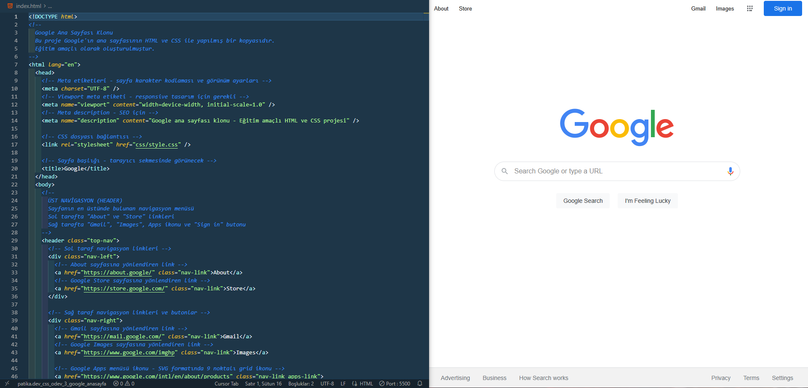

# Google Ana Sayfası Klonu - CSS Ödev 3

> ⚠️ **Bu proje eğitim amaçlıdır.**

**Eğitim Amaçlıdır**: Bu proje, Patika.dev CSS eğitimi kapsamında geliştirilmiş bir Google ana sayfası klonudur. Site, HTML ve CSS kullanılarak oluşturulmuş, güncel Google ana sayfasının görsel bir benzer kopyasını sunmaktadır. Bu proje tamamen eğitim amaçlıdır.

## 📋 Proje Hakkında

**⚠️ Önemli Not**: Bu proje tamamen eğitim amaçlıdır.

Google Ana Sayfası Klonu, Google'ın güncel ana sayfasının görsel ve yapısal bir kopyasını oluşturmaktadır. Bu proje, modern web tasarım tekniklerini öğrenmek isteyen öğrenciler için eğitim amaçlı hazırlanmıştır. Flexbox layout, modern CSS özellikleri ve responsive tasarım prensipleri kullanılmıştır.

### 📜 Google Hakkında

Google, 1996 yılında Stanford Üniversitesi'nde doktora öğrencileri Larry Page ve Sergey Brin tarafından kurulmuştur. Şirket, 1998 yılında resmi olarak yayınlanmış ve günümüzde dünyanın en büyük arama motoru ve teknoloji şirketlerinden biri haline gelmiştir. Bu proje, Google'ın güncel ana sayfasının benzer görsel bir kopyasını sunmaktadır.

## 🎯 Özellikler

- **Modern Tasarım**: Güncel Google ana sayfasının görsel olarak benzer kopyası
- **Responsive Layout**: Flexbox kullanılarak oluşturulmuş esnek düzen
- **Arama Fonksiyonu**: Google Search ve "I'm Feeling Lucky" butonları
- **Sesle Arama**: Mikrofon ikonu ile sesli arama özelliği
- **Üst Navigasyon**: About, Store, Gmail, Images linkleri ve Sign in butonu
- **Footer Bilgileri**: Privacy, Terms, Settings ve diğer yasal linkler
- **Hover Efektleri**: Modern interaktif kullanıcı deneyimi
- **SVG İkonlar**: Ölçeklenebilir vektör grafikleri

## 📁 Proje Yapısı

```
patika.dev_css_odev_3_google_anasayfa/
│
├── images/
│   ├── logo.png          # Google logosu
│   └── voicelogo.png     # Sesle arama ikonu
│
├── css/
│   └── style.css         # CSS stilleri
│
├── index.html            # Ana HTML dosyası
└── README.md             # Proje dokümantasyonu
```

## 🖼️ Sayfa Yapısı



### Ana Bölümler

1. **Üst Navigasyon (Header)**
   - Sol taraf: "About" ve "Store" linkleri
   - Sağ taraf: "Gmail", "Images", Apps ikonu (9 noktalı grid) ve "Sign in" butonu
   - Mavi arka planlı Sign in butonu (#1a73e8)

2. **Ana İçerik (Main Content)**
   - **Google Logo**: Sayfanın merkezinde, 272x92px boyutunda
   - **Arama Kutusu**: 
     - Yuvarlatılmış köşeler (border-radius: 24px)
     - Sol tarafta arama ikonu (büyüteç)
     - Sağ tarafta sesle arama ikonu (mikrofon)
     - Hover ve focus durumlarında gölge efektleri
   - **Arama Butonları**:
     - "Google Search" butonu
     - "I'm Feeling Lucky" butonu
     - Açık gri arka plan (#f8f9fa)
     - Hover efektleri ile interaktif deneyim

3. **Footer (Alt Bilgi Bölümü)**
   - Sol taraf: "Advertising", "Business", "How Search works" linkleri
   - Sağ taraf: "Privacy", "Terms", "Settings" linkleri
   - Açık gri arka plan (#f2f2f2)

## 🎨 Tasarım Özellikleri

### Renk Paleti

- **Arka Plan**: `#FFFFFF` (Beyaz)
- **Arama Kutusu Border**: `#dfe1e5` (Açık gri)
- **Arama Kutusu Hover**: Gölge efekti
- **Buton Arka Plan**: `#f8f9fa` (Açık gri)
- **Buton Border**: `#f2f2f2` (Çok açık gri)
- **Buton Hover Border**: `#dadce0` (Orta gri)
- **Buton Metin**: `#3c4043` (Koyu gri)
- **Sign in Butonu**: `#1a73e8` (Mavi)
- **Sign in Hover**: `#1765cc` (Koyu mavi)
- **Footer Arka Plan**: `#f2f2f2` (Açık gri)
- **Footer Linkler**: `#70757a` (Gri)
- **Navigasyon Linkler**: `rgba(0, 0, 0, 0.87)` (Koyu siyah)

### Tipografi

- **Font Ailesi**: Arial, sans-serif
- **Font Boyutu**: 
  - Navigasyon: 13px
  - Arama Input: 16px
  - Butonlar: 14px
  - Footer: 14px
- **Font Ağırlığı**: Normal (400), Sign in butonu için 500

### Layout

- **Flexbox Layout**: Modern esnek düzen sistemi
- **Ortalama**: Margin auto ve flexbox justify-content ile
- **Padding**: 
  - Üst navigasyon: 6px (üst-alt) x 14px (sağ-sol)
  - Arama kutusu: 5px (üst) x 8px-16px (yanlar)
  - Butonlar: 0px (üst-alt) x 16px (sağ-sol)
  - Footer: 15px (her yönden)
- **Border Radius**: 
  - Arama kutusu: 24px (tam yuvarlatılmış)
  - Butonlar: 4px (hafif yuvarlatılmış)
  - Sign in butonu: 4px

## 🚀 Kullanım

1. Projeyi bilgisayarınıza indirin veya klonlayın
2. `index.html` dosyasını bir web tarayıcısında açın
3. Google ana sayfasının görsel kopyasını keşfedin!

## 📝 Teknik Detaylar

### HTML Yapısı

- Semantik HTML5 etiketleri kullanılmıştır (`<header>`, `<main>`, `<footer>`)
- İngilizce dil desteği (`lang="en"`)
- Responsive meta etiketleri (`viewport`)
- SVG formatında ikonlar (ölçeklenebilir grafikler)
- Detaylı yorum satırları ile kod açıklamaları
- Erişilebilirlik özellikleri (`alt` etiketleri, `focusable="false"`)

### CSS Özellikleri

- **Flexbox Layout**: Modern esnek düzen sistemi
- **CSS Reset**: Body margin ve padding sıfırlama
- **Hover Efektleri**: Linkler ve butonlar için interaktif deneyim
- **Focus States**: Klavye navigasyonu için focus efektleri
- **Box Shadow**: Gölge efektleri ile derinlik hissi
- **Border Radius**: Yuvarlatılmış köşeler ile modern görünüm
- **Responsive Design**: Küçük ekranlar için media queries
- **CSS Variables**: Tutarlı renk kullanımı (doğrudan hex kodları)

### Özel CSS Özellikleri

- **Flexbox ile Ortalama**: `justify-content: center` ve `align-items: center`
- **Gölge Efektleri**: `box-shadow` ile hover ve focus durumları
- **Transition**: Hover geçişleri için yumuşak animasyonlar
- **Fixed Footer**: Sayfa kaydırılsa bile alt kısımda sabit kalır
- **Responsive Breakpoints**: 600px altındaki ekranlar için özel stiller

### Kullanılan CSS Özellikleri

- `display: flex` - Flexbox layout
- `justify-content` - Yatay hizalama
- `align-items` - Dikey hizalama
- `border-radius` - Yuvarlatılmış köşeler
- `box-shadow` - Gölge efektleri
- `position: fixed` - Sabit pozisyon
- `hover` - Fare ile üzerine gelme efektleri
- `focus-within` - Odaklanma durumu
- `media queries` - Responsive tasarım

## 🔧 Özelleştirme

CSS dosyasındaki değerleri değiştirerek renkleri, fontları ve düzeni özelleştirebilirsiniz:

- `css/style.css` dosyasını düzenleyin
- Renk kodlarını değiştirin (`#1a73e8`, `#f8f9fa`, vb.)
- Font ailesini güncelleyin (`Arial, sans-serif`)
- Padding ve margin değerlerini ayarlayın
- Border radius değerlerini değiştirin
- Box shadow değerlerini özelleştirin

## 📚 Öğrenilen CSS Konuları

Bu projede aşağıdaki CSS konuları uygulanmıştır:

1. **Flexbox Layout**: Modern esnek düzen sistemi
2. **CSS Selectors**: Class, element ve attribute seçicileri
3. **Pseudo-classes**: `:hover`, `:focus`, `:focus-within`
4. **Box Model**: Margin, padding, border kullanımı
5. **Positioning**: `fixed`, `relative`, `absolute`
6. **Typography**: Font family, size, weight, color
7. **Colors**: Hex, rgba renk formatları
8. **Shadows**: Box-shadow efektleri
9. **Border Radius**: Yuvarlatılmış köşeler
10. **Responsive Design**: Media queries ile mobil uyumluluk

## 🎓 Eğitim Kaynakları

Bu projede kullanılan teknikler hakkında daha fazla bilgi için:

- [MDN Web Docs - Flexbox](https://developer.mozilla.org/en-US/docs/Web/CSS/CSS_Flexible_Box_Layout)
- [W3Schools - CSS Tutorial](https://www.w3schools.com/css/)
- [Fatih Hayrioğlu - CSS Kaynakları](https://fatihhayrioglu.com/)

## 👨‍💻 Geliştirici

**Bahadır B. Bekdemir**

Bu proje eğitim amaçlı geliştirilmiştir.

## 📄 Lisans

© 2026 Tüm Hakları Saklıdır.

---

**⚠️ Önemli Uyarı**: Bu proje Patika.dev CSS eğitimi kapsamında hazırlanmıştır ve **tamamen eğitim amaçlıdır**. Google'ın ticari markaları ve telif hakları Google LLC'ye aittir. Bu proje sadece eğitim ve öğrenme amaçlıdır. Ticari kullanım için tasarlanmamıştır.

## 🔗 Referanslar

Bu proje, Google'ın resmi ana sayfasından esinlenilerek oluşturulmuştur:
- **Google Ana Sayfa**: [https://www.google.com/](https://www.google.com/)

